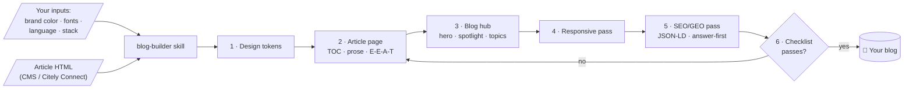

# Citely Blog Kit

**Teach your AI coding agent to build a world-class blog.** A [Claude Skill](https://agentskills.io) that gives Claude Code, Cursor, or any SKILL.md-compatible agent the complete standard for a professional blog UI — auto-generated table of contents, reading UX, responsive tiers, and SEO/GEO-ready markup for the AI-search era.

[](https://agentskills.io)
[](https://claude.com/claude-code)
[](#-getting-started-5-minutes)
[](./LICENSE)
[](https://citely-seo.com)

<!-- Screenshots (roadmap): render templates/article.html + templates/hub.html, capture light & dark, then uncomment:


-->

> 🇻🇳 **Tiếng Việt:** Bộ skill giúp AI agent của bạn tự build giao diện blog chuẩn (trang tổng quan + trang bài viết): mục lục tự sinh, thanh tiến độ đọc, bảng đẹp, responsive, schema SEO/GEO 2026 — theo tiêu chuẩn [Citely](https://citely-seo.com) gợi ý. Copy vào repo, ra lệnh cho agent là xong.

## 🧭 Why this exists

[Citely](https://citely-seo.com) delivers SEO/GEO-optimized articles to any platform via **Citely Connect** — but many destinations (custom sites, Cloudflare Pages, static sites, headless CMS frontends) simply **don't have a blog UI** to render them well.

Ask an AI agent to "build me a blog" without a standard and you get slop: hardcoded TOCs, unreadable tables, fake ratings, broken mobile layouts, 2020-era schema. This kit fixes that at the root: it encodes the full standard — distilled from Citely's own production blog — as an agent skill. Your agent reads it, asks for your brand color, and ships a blog that meets the bar. **Your brand, our standard.**

## ✨ Key features

- 📑 **Auto-generated 2-level TOC** — parsed from H2/H3 at render time, scroll-spy highlighting, clean URLs (no `#hash` pollution)
- 📈 **Reading UX that keeps people on page** — progress bar, 65–75ch prose column, three-tier text grays, back-to-top with progress ring
- 🎨 **Token-first & brand-agnostic** — you provide **one hex color**; the skill derives the palette, gradient, dark mode, and checks WCAG AA contrast
- 📊 **Bare-tag prose styling** — CMS HTML arrives with zero classes; tables get rounded frames, caption banners, and horizontal-scroll wrappers
- 🤖 **SEO/GEO 2026, not 2020** — answer-first sections, TL;DR "citation magnet" blocks, `BlogPosting` + `Person` + `Organization` + `BreadcrumbList` JSON-LD, `dateModified` freshness — built for AI Overviews, ChatGPT & Perplexity citations
- 📱 **Explicit responsive tiers** — mobile `<details>` TOC, horizontal share bar, snap-scroll related sliders, zero horizontal overflow
- 🧩 **Works with any stack** — plain HTML, React/Next, Astro, Vue, PHP themes; two single-file reference templates included
- ✅ **Definition of Done checklist** — the agent audits its own work before calling the blog "finished"
- 🚫 **Hard rules against slop** — no fake numbers, no third-party ads, no hardcoded years, motion gated by `prefers-reduced-motion`

## 📦 What's inside

```
skills/blog-builder/
├── SKILL.md                  # Agent instructions: workflow, inputs, hard rules
├── references/
│   ├── design-tokens.md      # Token set, brand-color math, dark mode, contrast rules
│   ├── article-page.md       # Article anatomy: layout grid, TOC, prose, tables, E-E-A-T blocks
│   ├── blog-hub.md           # Hub anatomy: hero, spotlight + most-read rail, topic sections
│   ├── responsive.md         # Breakpoint tiers + mobile non-negotiables
│   ├── seo-geo.md            # Schema JSON-LD, answer-first, TL;DR, freshness (2026 reality)
│   ├── content-contract.md   # Rendering article HTML from a CMS / Citely Connect
│   └── checklist.md          # Definition of Done
└── templates/
    ├── article.html          # Working single-file reference — article page
    └── hub.html              # Working single-file reference — blog hub
```

## ⚙️ How it works



## 🚀 Getting started (5 minutes)

**Prerequisites:** an AI coding agent that reads skills — [Claude Code](https://claude.com/claude-code), Cursor, Codex, or anything supporting the [Agent Skills](https://agentskills.io) standard. No runtime, no build step, no dependencies.

**1. Install the skill into your project:**

```bash
git clone https://github.com/stephenpham68/citely-blog-kit
cp -r citely-blog-kit/skills/blog-builder your-project/.claude/skills/blog-builder
```

**2. Ask your agent:**

```
Build a blog for my site using the blog-builder skill.
Brand color #0e7490, font Inter, language Vietnamese, stack Next.js.
Articles come from my Citely Connect endpoint.
```

**3. That's it.** The agent asks for anything missing, builds tokens → article page → hub → responsive → schema, then self-audits against the checklist.

Want to see the target before building? Open [`templates/article.html`](./skills/blog-builder/templates/article.html) and [`templates/hub.html`](./skills/blog-builder/templates/hub.html) directly in a browser — they're fully working, zero-dependency reference implementations.

## 📐 The standard at a glance

| Area | The bar | Spec |
|---|---|---|
| Theming | 1 brand hex in → full AA-checked palette + dark mode out | [`design-tokens.md`](./skills/blog-builder/references/design-tokens.md) |
| Article | 3-column grid, auto-TOC + scroll-spy, styled bare tags | [`article-page.md`](./skills/blog-builder/references/article-page.md) |
| Hub | Compact hero, most-read rail (real data only), topic sections | [`blog-hub.md`](./skills/blog-builder/references/blog-hub.md) |
| Mobile | Explicit tiers, 44px tap targets, zero horizontal overflow | [`responsive.md`](./skills/blog-builder/references/responsive.md) |
| SEO/GEO | Answer-first + TL;DR, `@graph` JSON-LD, `dateModified` | [`seo-geo.md`](./skills/blog-builder/references/seo-geo.md) |
| Content | Bare-tag HTML contract, graceful degradation | [`content-contract.md`](./skills/blog-builder/references/content-contract.md) |

## 🗺️ Roadmap

- [ ] Screenshots of both templates (light + dark)
- [ ] Category/archive page standard
- [ ] Author archive page standard
- [ ] Framework example: Next.js App Router port of the templates
- [ ] Framework example: Astro port
- [ ] i18n string pack (EN/VI) for UI labels
- [ ] Select-to-quote image sharing (optional module)

## 🤝 Contributing

PRs welcome! Keep them aligned with the kit's philosophy:

1. **Standards over snippets** — changes must improve the *standard*, not add one-off tricks.
2. **Stack-agnostic core** — framework-specific code lives under future `examples/`, never in `references/`.
3. **No slop** — anything violating the hard rules in [`SKILL.md`](./skills/blog-builder/SKILL.md) (fake numbers, hardcoded TOC/years, light-only theming) is declined.
4. Keep `SKILL.md` under 250 lines and each reference under 400 — agents read this; brevity is a feature.

## 📄 License & author

MIT © [Citely](https://citely-seo.com) — the SEO/GEO content platform. See the standard in production on the [Citely Blog](https://citely-seo.com/blog), or read [what the different types of SEO are](https://citely-seo.com/blog/cac-loai-seo-pho-bien-huong-dan-phan-biet-onpage-offpage-va-technical-seo) — rendered with this exact standard.
